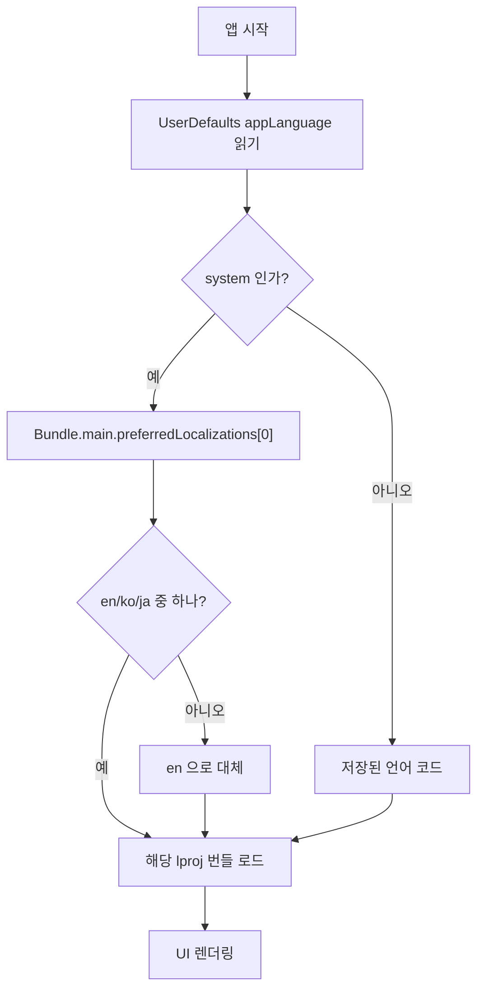

# 다국어(i18n) 설계

MyMacTools UI 를 **한국어 · 영어 · 일본어** 로 제공하고, 앱 안에서 언어를 바꿀 수 있게 한다.

- 상태: 설계 확정 대기 (구현 전)
- 작성일: 2026-09-09

---

## 1. 결정 요약

| 항목 | 결정 |
| --- | --- |
| 문자열 저장소 | `.lproj/Localizable.strings` (표준 macOS 방식) |
| 번들 위치 | `MyMacTools.app/Contents/Resources/{en,ko,ja}.lproj` |
| 조회 API | `Bundle.main` — **`Bundle.module` 은 쓰지 않는다** |
| SwiftPM `resources:` | 쓰지 않는다. 빌드 스크립트가 직접 복사한다 |
| 언어 전환 | 앱 재시작 없이 즉시 (`ObservableObject` + 강제 lproj 조회) |
| 기본값 | 시스템 언어 따름 → 미지원 언어면 영어 |
| 저장 | `UserDefaults` (`appLanguage`) |

---

## 2. 왜 `Bundle.module` 을 쓰지 않는가

SwiftPM 의 `resources:` + `Bundle.module` 이 자연스러워 보이지만, **이 저장소처럼
`.app` 을 손으로 조립하는 구조에서는 깨진다.** 스크래치 패키지로 실제 확인했다.

SwiftPM 이 생성하는 접근자는 후보 경로가 **딱 두 개**다.

```swift
let mainPath  = Bundle.main.bundleURL.appendingPathComponent("Spike_Spike.bundle").path
let buildPath = "/.../scratchpad/spike/.build/arm64-apple-macosx/release/Spike_Spike.bundle"
guard let bundle = Bundle(path: mainPath) ?? Bundle(path: buildPath) else {
    Swift.fatalError("could not load resource bundle: ...")
}
```

여기서 나오는 문제 세 가지.

1. **`Contents/Resources/` 를 보지 않는다.** `Bundle.main.bundleURL` 은 `MyMacTools.app/` 이라,
   리소스 번들을 `Contents/` **옆** 에 둬야 잡힌다. 표준 `.app` 레이아웃이 아니고 서명 규약에도 어긋난다.
2. **못 찾으면 `fatalError` 로 즉사한다.** 문자열만 안 나오는 게 아니라 앱이 크래시한다.
3. **개발 머신에서는 버그가 숨는다.** 하드코딩된 `buildPath` 가 fallback 이라
   `.build` 가 남아 있는 동안은 잘 동작한다. `.build` 를 지우거나 다른 맥에 복사하는 순간 터진다.

실측:

```
# Contents/Resources/ 에 번들을 넣고 .build 를 치운 뒤 실행
Fatal error: could not load resource bundle:
  from .../Spike.app/Spike_Spike.bundle
  or   .../.build/arm64-apple-macosx/release/Spike_Spike.bundle
(종료코드 133)
```

반면 **표준 방식(`Contents/Resources/*.lproj` + `Bundle.main`)은 `.build` 없이도 정상 동작한다.**

```
Bundle.main    = .../Spike2.app
localizations  = ["en", "ja", "ko"]
preferred      = ["ko"]           # 시스템 언어 자동 반영
system  -> 시작
forced en -> Start
forced ko -> 시작
forced ja -> 開始
```

시스템 언어 자동 추종과 언어 강제 조회가 **둘 다** 되는 것까지 확인했다.
그래서 `Package.swift` 는 손대지 않고, 빌드 스크립트가 `.lproj` 를 앱 번들에 넣는다.

---

## 3. 파일 구조

```
Resources/
  Info.plist                       # 기존
  en.lproj/Localizable.strings     # 신규
  ko.lproj/Localizable.strings     # 신규
  ja.lproj/Localizable.strings     # 신규
Sources/MyMacTools/
  Localization.swift               # 신규 - AppLanguage, L10n, Key
  BlackWorkManager.swift           # 변경 없음
  ContentView.swift                # 문자열을 L10n 조회로 교체
  MyMacToolsApp.swift              # L10n 주입
docs/
  i18n-design.md                   # 이 문서
```

문자열은 UI 계층에만 있으므로 `BlackWorkManager` 는 건드리지 않는다.

---

## 4. 언어 결정 흐름



---

## 5. 코드 설계

```swift
enum AppLanguage: String, CaseIterable, Identifiable {
    case system, ko, en, ja

    var id: String { rawValue }

    /// 선택 메뉴에 보일 이름. 각 언어의 자기 이름으로 쓰고 번역하지 않는다.
    var displayName: String {
        switch self {
        case .system: return "System"   // 이 항목만 현재 언어로 번역한다
        case .ko:     return "한국어"
        case .en:     return "English"
        case .ja:     return "日本語"
        }
    }
}

final class L10n: ObservableObject {
    @Published var language: AppLanguage { didSet { persist(); reload() } }
    private var bundle: Bundle = .main

    func callAsFunction(_ key: Key) -> String
    func callAsFunction(_ key: Key, _ args: CVarArg...) -> String
}
```

- 키는 `enum Key: String` 으로 두어 오타를 컴파일 타임에 잡는다.
- 뷰에서는 `Text(l10n(.buttonStart))` 처럼 **`String` 을 넘긴다.**
  `Text("literal")` 형태로 두면 SwiftUI 가 `LocalizedStringKey` 로 해석해
  `Bundle.main` + 환경 locale 로 **따로** 조회하므로, 앱 내 강제 선택과 어긋난다.
- `@Published` 라 언어를 바꾸면 뷰가 즉시 다시 그려진다. 재시작이 필요 없다.

---

## 6. 문자열 키 목록

`%d`, `%@` 위치가 언어마다 다르므로 **문장 전체를 한 키로 둔다.** 조각을 이어붙이지 않는다.

| 키 | en | ko | ja |
| --- | --- | --- | --- |
| `status.working` | Working — screen off | 작업 중 — 화면 꺼짐 | 作業中 — 画面オフ |
| `status.idle` | Idle | 대기 중 | 待機中 |
| `label.keepWorking` | Keep working | 유지 시간 | 継続時間 |
| `label.screenOffIn` | Screen off in | 화면 끄기 | 画面オフ |
| `label.language` | Language | 언어 | 言語 |
| `unit.hour` | h | 시간 | 時間 |
| `unit.minute` | m | 분 | 分 |
| `unit.second` | sec | 초 후 | 秒後 |
| `toggle.sleepWhenDone` | Sleep when time is up | 시간이 끝나면 잠자기 | 終了時にスリープ |
| `caption.unlimited` | 0h 00m = keep going until you press Stop | 0시간 00분 = Stop 을 누를 때까지 계속 | 0時間00分 = Stop を押すまで継続 |
| `caption.willSleep` | The Mac sleeps when the time is up | 시간이 끝나면 잠자기로 전환됩니다 | 終了時にスリープします |
| `caption.normalSleep` | Sleep behaviour returns to normal when the time is up | 시간이 끝나면 평소 절전 동작으로 돌아갑니다 | 終了時に通常の省エネ動作に戻ります |
| `button.start` | Start | 시작 | 開始 |
| `button.stop` | Stop | 정지 | 停止 |
| `progress.screenOff` | Screen turns off in %ds | %d초 후 화면이 꺼집니다 | %d秒後に画面が消えます |
| `progress.remaining` | %@ left | %@ 남음 | 残り %@ |
| `progress.noLimit` | no time limit | 시간 제한 없음 | 時間制限なし |
| `language.system` | System | 시스템 설정 | システム設定 |

앱 이름 `MyMacTools` 는 번역하지 않는다.

`progress.remaining` 의 `%@` 가 en/ko 는 앞, ja 는 뒤에 온다. 조각 이어붙이기를 금지하는 이유다.

---

## 7. 빌드 · 번들 변경

### `scripts/build-app.sh`

```bash
mkdir -p "${CONTENTS}/Resources"
for lproj in Resources/*.lproj; do
    [ -d "$lproj" ] && cp -R "$lproj" "${CONTENTS}/Resources/"
done
```

### `Resources/Info.plist`

```xml
<key>CFBundleDevelopmentRegion</key><string>en</string>
<key>CFBundleLocalizations</key>
<array><string>en</string><string>ko</string><string>ja</string></array>
```

`CFBundleLocalizations` 는 `.lproj` 폴더와 정보가 겹쳐서 `Bundle.main.localizations` 에
값이 중복으로 잡힌다(`["en","en","ja","ja","ko","ko"]`). 동작에는 영향 없고 `[0]` 만 쓰지만,
거슬리면 `CFBundleLocalizations` 쪽을 빼도 된다. Finder·시스템 설정의 "언어" 표시를
위해 남겨두는 쪽을 택한다.

---

## 8. 알려진 한계

- **macOS 기본 메뉴(앱 메뉴의 종료·서비스 등)는 시스템 언어를 따른다.** 앱 안에서 고른 언어와
  다를 수 있다. 이건 시스템이 그리는 메뉴라 앱에서 못 바꾼다.
- **레이아웃.** 현재 창 너비가 `300` 고정이다. 일본어·한국어 라벨이 영어보다 길어
  잘릴 수 있다. 라벨 고정폭(`frame(width: 96)`)을 유동으로 바꾸거나 너비를 늘려야 한다.
  구현 중 실제 화면으로 확인이 필요하다.
- **번역 품질.** 위 번역은 초안이다. 특히 일본어는 검수받은 적 없다.
- 서명은 여전히 ad-hoc 이라 `.lproj` 추가가 배포 시 Gatekeeper 경고를 없애주지는 않는다.

---

## 9. 구현 순서

1. `Resources/{en,ko,ja}.lproj/Localizable.strings` 추가
2. `Sources/MyMacTools/Localization.swift` 추가 (`AppLanguage`, `L10n`, `Key`)
3. `ContentView` 문자열을 `l10n(...)` 조회로 교체 + 언어 선택 Picker 추가
4. `MyMacToolsApp` 에서 `L10n` 을 `@StateObject` 로 만들어 주입
5. `Info.plist` · `build-app.sh` 갱신
6. 검증

## 10. 검증 계획

| 항목 | 방법 |
| --- | --- |
| 3개 언어 문자열이 모두 조회되는가 | 하네스로 `L10n` 을 직접 돌려 전체 키 × 3언어 출력 |
| 키 누락 | 각 `.strings` 의 키 집합이 `Key.allCases` 와 일치하는지 비교 |
| `.build` 없이도 동작 | `.build` 를 치운 뒤 `.app` 실행 |
| 시스템 언어 추종 | `Bundle.main.preferredLocalizations` 확인 |
| 런타임 전환 | GUI 에서 직접 확인 (자동화 불가 — 보조 접근 권한 없음) |
| 레이아웃 깨짐 | GUI 에서 3개 언어 직접 확인 |

마지막 두 항목은 자동 검증이 안 된다. 사용자 확인이 필요하다.
