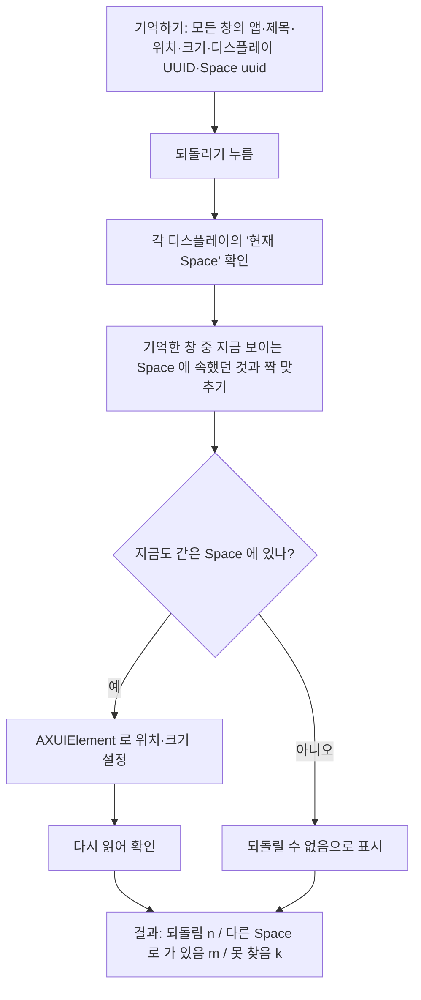

# research — window-positions

> 조사만 한 문서다. `spec.md` · `checklist.md` 는 아래 *결정이 필요한 축* 을 사용자와
> 확정한 뒤에 쓴다.

## 원 요청 (2026-09-28)

> 여기에 새로운 기능으로 '윈도우 위치로' 기능을 만들려고해. 기술검토해서 문서남겨줘.
> 맥북의 모든 창의 위치를 기억하고, 기억한 위치로 이동시키는 기능이야.
> 맥북 Spaces 와 외장모니터 위치까지 전부 기억해야해.

## 결론

**기억하는 것은 전부 된다. 되돌리는 것은 절반만 된다.**

| 할 일 | 가능 여부 | 수단 |
|---|---|---|
| 모든 창의 위치·크기 기억 | [확정] 됨 | `CGWindowListCopyWindowInfo` |
| 어느 디스플레이인지 기억 | [확정] 됨 | 디스플레이 UUID |
| 어느 Space 인지 기억 | [확정] 됨 — **비공개 API** | `CGSCopySpacesForWindows` |
| 같은 Space 안에서 위치·크기 되돌리기 | [가정] 됨 — 손쉬운 사용 권한 필요 | `AXUIElement` |
| 다른 디스플레이로 되돌리기 | [가정] 됨 — 그 디스플레이의 **지금 Space** 로만 | `AXUIElement` |
| **다른 Space 로 되돌리기** | **[확정] 안 됨** | 비공개 API 도 남의 창에는 무시된다 |

요청의 핵심인 "Spaces 까지 전부" 는 **기억까지만 된다.** 창을 원래 Space 로 돌려보내는
방법은 SIP 를 끄는 것 말고는 찾지 못했다.

## 실측한 것

프로브 소스는 `probes/` 에 있다. 모두 macOS 26 (Darwin 25.6.0), 디스플레이 3대, Space 10개
환경에서 돌렸다.

### 읽기 — 전부 된다

```
── 디스플레이 ──
  id=3  LF24T450F                bounds=0,0 1920x1080       UUID=724D2DB8-…
  id=1  Built-in Retina Display  bounds=-763,1080 1512x982  UUID=37D8832A-…
  id=2  S24E450                  bounds=-1920,0 1920x1080   UUID=346A1226-…

── Spaces (비공개 CGSCopyManagedDisplaySpaces) ──
  display 724D2DB8-…  spaces=[5, 6*, 7, 8]
  display 346A1226-…  spaces=[15, 10*, 11]
  display 37D8832A-…  spaces=[16*, 13, 14]        (* = 그 디스플레이의 현재 Space)

── 창 → Space (비공개 CGSCopySpacesForWindows) ──
  #763 Raycast        -1050,187  1000x650  space=[10]
  #652 Google Chrome  -1372,1344 1492x929  space=[13]
```

- 디스플레이마다 Space 가 따로 있다 (`com.apple.spaces spans-displays` 키 없음 = 기본값).
  그래서 **"디스플레이 + 그 디스플레이 안의 몇 번째 Space"** 로 기억해야 한다.
- 비공개 API 지만 `dlsym` 으로 부르면 권한 없이 읽힌다.

### 다른 Space 로 옮기기 — 자기 창만 되고 남의 창은 안 된다

창을 띄우는 프로세스와 옮기는 프로세스를 **따로** 두고 시험했다. 한 프로세스 안에서만
시험하면 된다고 오판하기 쉽다.

```
자기 창   CGSMoveWindowsToManagedSpace 6 → 5   결과 space=[5]  성공

남의 창   시작 space=[7]
  [A] CGSMoveWindowsToManagedSpace → 5         결과 space=[7]  실패(무시됨)
  [B] CGSAddWindowsToSpaces + Remove → 5       결과 space=[7]  실패(무시됨)
  [C] CGSMoveWindow (위치)                     반환=0 위치 그대로  실패
```

**오류도 없이 조용히 무시된다.** 반환값만 보면 성공한 것처럼 보인다. 그래서 되돌린 뒤에는
반드시 다시 읽어 확인해야 한다.

위치(`[C]`)도 비공개 API 로는 안 움직인다. 남의 창 위치·크기는 손쉬운 사용 API
(`AXUIElement`) 로만 바꿀 수 있다.

## 핵심 제약

### 1. 다른 Space 로는 돌려보낼 수 없다

남의 창을 다른 Space 로 옮기려면 Dock 프로세스 안에서 호출해야 한다. yabai 가 그렇게 하고,
그러려면 **SIP 를 일부 꺼야** 한다. 회사 맥이라 기각한다.

### 2. 손쉬운 사용 권한 — ad-hoc 서명이라 **고칠 때마다 다시 허용**해야 한다

`AXUIElement` 로 남의 창을 움직이려면 손쉬운 사용 권한이 필요하다. TCC 는 권한을 코드 서명에
묶는데, 이 앱은 ad-hoc 서명이라 designated requirement 가 `cdhash` 다.

이 저장소에서 이미 쟀다 — 소스가 같으면 재빌드해도 cdhash 가 같지만, **코드를 고치면
바뀐다** (`aed0539f…` → `1b7f0bf0…`, 2026-09-18). 즉 **앱을 고쳐 재설치할 때마다 손쉬운 사용
권한을 다시 켜야 할 가능성이 높다.** [가정 — 권한을 실제로 켜고 재빌드해 확인하지 않았다]

개발 중에는 꽤 성가시다. 해결하려면 개인 인증서로 서명해 designated requirement 를
식별자 기준으로 바꿔야 한다 (`docs/sharing.md` 의 서명 항목과 같은 문제).

### 3. 창을 다시 알아보는 방법이 마땅치 않다

- **창 번호는 앱을 다시 켜면 바뀐다.** 기억한 번호로는 못 찾는다.
- 그래서 `번들 ID + 창 제목 + 같은 제목 안에서 몇 번째` 로 짝을 지어야 한다.
- 제목은 **화면 기록 권한**이 있어야 `CGWindowList` 로 읽힌다. 실측에서 창 252개 중 제목이
  나온 것은 29개였다 (프로브를 띄운 터미널은 화면 기록 권한이 있는 상태였다).
  손쉬운 사용 권한이 있으면 `AXTitle` 로도 읽을 수 있다.
- **제목이 같은 창이 여럿이면 모호하다.** 터미널 탭, 이름 없는 문서 창이 전형이다.
  제목이 바뀌는 창(브라우저 탭 전환)도 짝이 틀어진다.

### 4. 창 목록 대부분은 "창"이 아니다

`layer 0` 창 252개 중 Space 에 속한 것은 17개뿐이었다. 나머지는 64x64 도우미 창, 자동 완성
팝업, 화면 밖 창이다. **걸러내는 규칙**(크기, 소유 앱, AX 에서 standard window 인지)이 필요하다.

### 5. 무엇으로 Space 를 기억하나

Space 항목에는 `ManagedSpaceID`(5, 6, …)와 `uuid` 가 함께 있다.

```
ManagedSpaceID=5  uuid=7C50F297-C48D-487C-8963-A2CE2430DC85
```

재부팅하거나 Space 를 추가·삭제·순서를 바꿨을 때 어느 쪽이 유지되는지는 [미정]. `uuid` 가
유지될 것으로 보이지만 확인하지 않았다.

### 6. 외장 모니터가 없을 때

디스플레이 ID(1, 2, 3)는 연결 순서에 따라 바뀐다. `CGDisplayCreateUUIDFromDisplayID` 의 UUID
는 재연결에도 유지된다고 알려져 있다 [가정 — 뽑았다 꽂아 확인하지 않았다].

기억한 모니터가 지금 없으면 어떻게 할지 정해야 한다 — 건너뛰기 / 주 디스플레이로 /
비율을 유지해 옮기기.

### 7. 제외해야 하는 것

- **전체 화면 창** — 제 Space 를 따로 가진다 (`type == 4`). 위치 개념이 없다.
- **최소화·숨긴 창** — `CGWindowList` 에 좌표는 나오지만 Space 가 비어 나온다.
- **Stage Manager** 가 켜져 있으면 위치를 앱 무리 단위로 관리해서 결과가 달라진다. [미정]

## Space 를 되돌리는 우회 후보

| 후보 | 방식 | 평가 |
|---|---|---|
| **현재 Space 만 되돌리기** | 사용자가 Space 를 넘기며 그때마다 누르면, 그 Space 에 원래 있던 창만 제자리로 | **추천.** 되는 것만 약속한다 |
| 창을 쥔 채 Space 전환 | 제목 막대를 누른 상태로 `⌃→` 를 합성 → 창이 따라온다 | 손쉬운 사용 필요. 화면이 번쩍이고 타이밍에 약하다. [미검증] |
| Dock "이 데스크탑에 지정" | `com.apple.spaces` 의 `app-bindings` | **앱** 단위다. 창 단위가 아니고, 앱을 다시 켤 때만 먹는다 |
| SIP 해제 + Dock 주입 | yabai 방식 | 기각. 회사 맥 |

## 되돌리기 흐름 (추천안)



"다시 읽어 확인" 을 빼면 안 된다. 실측처럼 **무시돼도 오류가 안 난다.**

## 결정이 필요한 축

1. **Space 를 어디까지 약속할지** — "현재 Space 만 되돌리기" 로 좁힐지, 창을 쥐고 전환하는
   우회까지 시도할지.
2. **모니터가 없을 때** — 건너뛰기 / 주 디스플레이로 / 비율 유지.
3. **기억 슬롯** — 하나만 / 이름 붙여 여러 개 (예: "외장 2대", "노트북만").
4. **권한 안내** — 손쉬운 사용·화면 기록 권한이 없을 때 무엇을 보여줄지. 둘 다 사용자가
   시스템 설정에서 직접 켜야 한다.
5. **자동 실행** — 모니터를 꽂았을 때 알아서 되돌릴지, 누를 때만 할지.
6. **새 Tool 인가** — 기존 Tool 과 겹치지 않아 새 Tool(`window-positions`)로 보는 게 맞다.
   이름을 정하면 `docs/glossary/README.md` 에 먼저 넣는다.

## 기각 후보

- **`CGSMoveWindow` / `CGSMoveWindowsToManagedSpace` 로 전부 처리** — 자기 창에만 먹는다 (실측).
- **SIP 해제** — 회사 맥.
- **창 번호로 짝 맞추기** — 앱을 다시 켜면 바뀐다.

## 미확인

- [ ] 손쉬운 사용 권한을 켠 앱에서 `AXUIElement` 로 **남의 창**이 실제로 움직이는지.
      이 조사는 권한 없는 터미널에서 돌려서 확인하지 못했다. 이 기능 전체가 여기에 걸려 있다.
- [ ] `AXWindows` 가 다른 Space 의 창까지 돌려주는지, 현재 Space 것만 주는지
- [ ] 코드를 고쳐 재설치하면 손쉬운 사용 권한이 풀리는지 (ad-hoc 서명)
- [ ] 재부팅·Space 재배치 후 Space `uuid` 가 유지되는지
- [ ] 외장 모니터를 뽑았다 꽂은 뒤 디스플레이 UUID 가 유지되는지
- [ ] Stage Manager 가 켜져 있을 때의 동작
- [ ] "창을 쥔 채 Space 전환" 우회가 macOS 26 에서 되는지

첫 항목부터 확인하기를 권한다. 안 되면 나머지는 의미가 없다.
